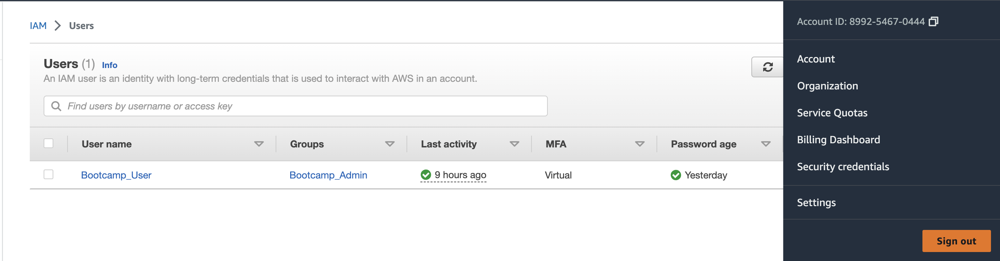
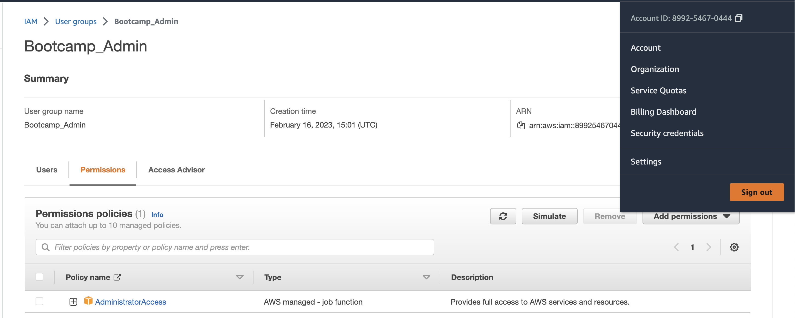
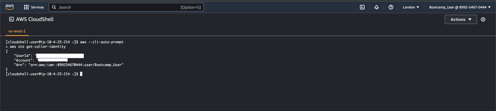
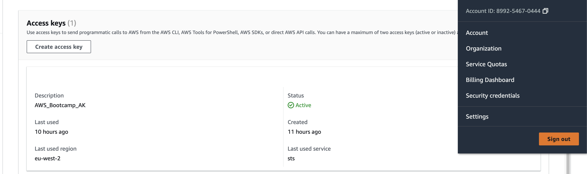
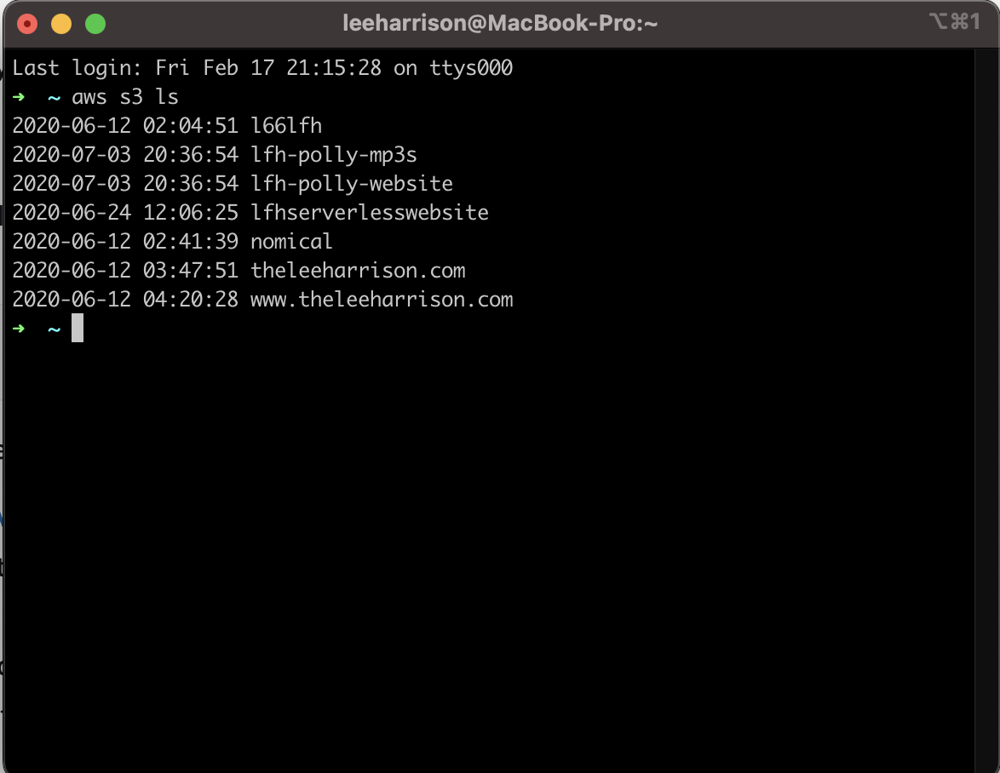

# Week 0 — Billing and Architecture
## Homework Submission - @theleeharrison

### Lucid Chart Conceptual Design

I was able to re-create the conceptual design document we discussed on the week0 live stream with ease. Understanding that this level of design document should be able to be understood by non technical stakeholders. The link to my lucid chart document is below.

```
https://lucid.app/lucidchart/f46ae2ea-ecbe-47bc-ad04-8cb1615be47a/edit?viewport_loc=-1562%2C-590%2C3382%2C2348%2C0_0&invitationId=inv_beef2982-c419-4ceb-9888-a0fed9409350
```

### Lucid Chart Architectural Design

I was able to follow and re-create the technical design document. This level of document should be the most complex as it should be understood by engineers and technical members of the team. I have a good idea of what all the different AWS services are and how we are bringing them together to create a cloud-native application "Cruddur". The link to my Lucid Chart document is below.

```
https://lucid.app/lucidchart/b3f11f42-8bed-4b5b-88d5-00c73b463c40/edit?viewport_loc=-1%2C-249%2C2831%2C1565%2C0_0&invitationId=inv_41861d44-a0ea-49db-93e9-05f0249457c1
```

### AWS Admin User Creation

I was able to create a new admin users from the IAM service in AWS by using my Root account. I create a new user, create a group called 'bootcamp_admin'. I then proceeded to add the 'AdministratorAccess' role to my group and I also added my user to that group. A screenshot demoing my actions is shown below.





### Use of AWS Cloudshell

I used AWS Cloudshell to display my Account Details, these have been redacted for security reasons in my screenshot, shown below.


### Generate AWS Credentials

I used the AWS GUI to generate an access key and secret access key, as well as setting my default region for the programatic access. These detials are shown below with the security concious information redacted.


### Install AWS CLI

I downloaded and installed the AWS CLI tool following the instuctions on the AWS CLI webpage, I am using Gitpod for the Bootcamp and I injected the auto-installer code into the .gitpod.yml file so AWS CLI installs each time. I am using my local machine for a different project right now so I have a differnet AWS Account connected here, please see a screenshot demonstrating an S3 ls command from AWS CLI.


I have also added an example where I am using AWS CLI from with my Gitpod.io workspace.


Create Billing Alarm

```

```

Create an AWS Budget

```

```