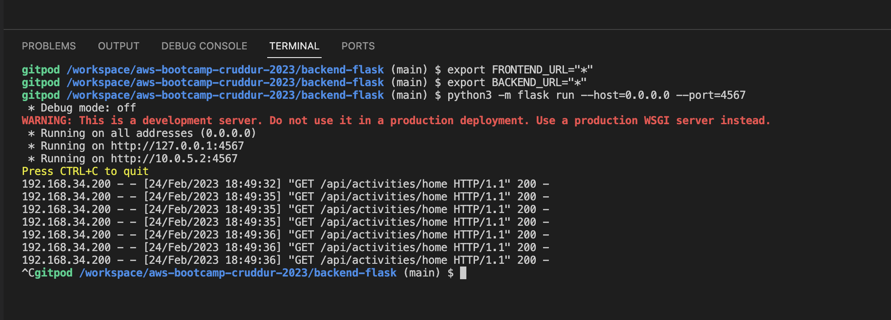
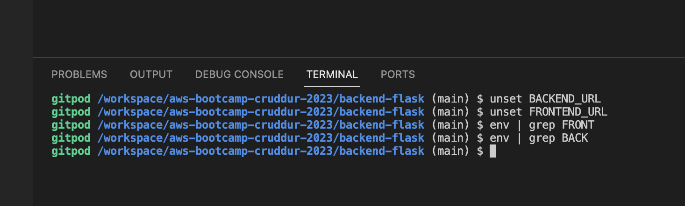
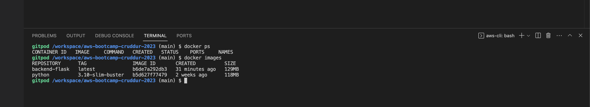
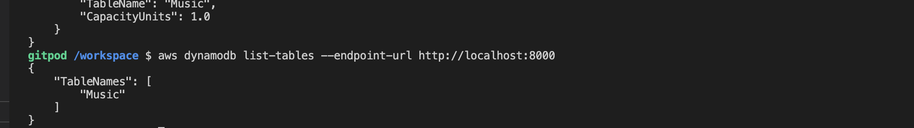
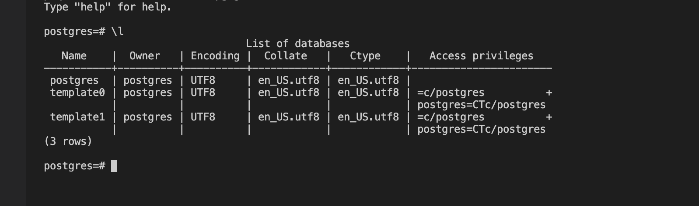
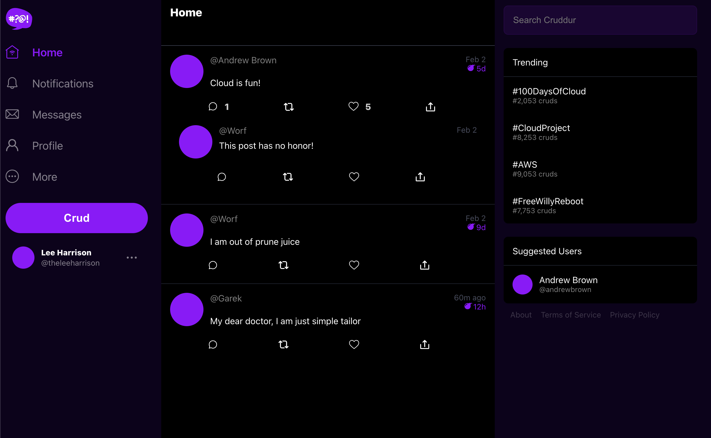
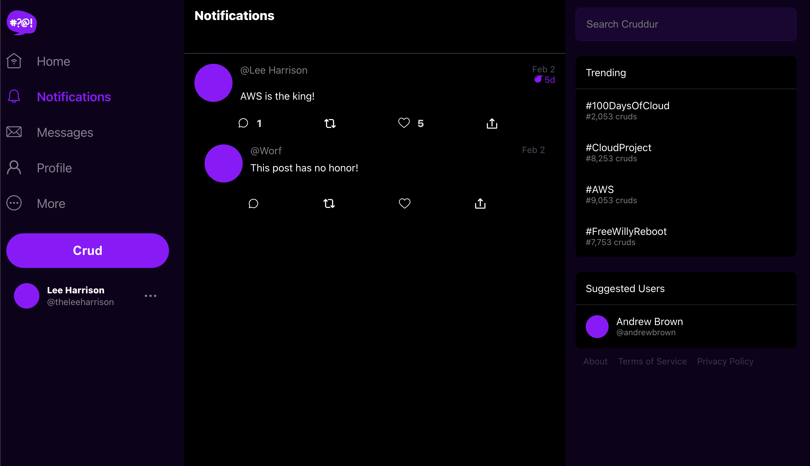

# Week 1 — App Containerization
## Homework Submission - @theleeharrison

### Creating the App - Backend and Frontend Containers

Docker wasn't present on my Gitpod environemnt so I went to the extentions tab within VSCode and installed it.

I created a [Dockerfile](https://github.com/theleeharrison/aws-bootcamp-cruddur-2023/blob/main/backend-flask/Dockerfile) within the backend-flask folder. The file contains the code shown below:

```dockerfile
FROM python:3.10-slim-buster

#Inside container
#Creates new folder inside container
WORKDIR /backend-flask


#Outside Container > Inside Container
COPY requirements.txt requirements.txt

#installs python libraries for use in app
RUN pip3 install -r requirements.txt

#Outside Container to Inside Container
# . (period) means everything in current dir
# first period /backend-flask outside container
# second period /backend-flask inside container
COPY . .

#sets env vars
ENV FLASK_ENV=development


EXPOSE ${PORT}

# command to run application within docker container
# python3 -m flask run --host=0.0.0.0 --port=4567 *this was a test to run in local gitpod*
CMD [ "python3", "-m" , "flask", "run", "--host=0.0.0.0", "--port=4567"]
```

I understood and set/unset 'Env Vars' within the Gitpod environment and passed these through to my Docker containers.




Used Docker command to views Images and check their state


Created [docker-compose.yml]https://github.com/theleeharrison/aws-bootcamp-cruddur-2023/blob/main/docker-compose.yml file to have both containers spin up at once and set all pre-reqs.

```docker-compose.yml
version: "3.8"
services:
  backend-flask:
    environment:
      FRONTEND_URL: "https://3000-${GITPOD_WORKSPACE_ID}.${GITPOD_WORKSPACE_CLUSTER_HOST}"
      BACKEND_URL: "https://4567-${GITPOD_WORKSPACE_ID}.${GITPOD_WORKSPACE_CLUSTER_HOST}"
    build: ./backend-flask
    ports:
      - "4567:4567"
    volumes:
      - ./backend-flask:/backend-flask
  frontend-react-js:
    environment:
      REACT_APP_BACKEND_URL: "https://4567-${GITPOD_WORKSPACE_ID}.${GITPOD_WORKSPACE_CLUSTER_HOST}"
    build: ./frontend-react-js
    ports:
      - "3000:3000"
    volumes:
      - ./frontend-react-js:/frontend-react-js
  dynamodb-local:
    # https://stackoverflow.com/questions/67533058/persist-local-dynamodb-data-in-volumes-lack-permission-unable-to-open-databa
    # We needed to add user:root to get this working.
    user: root
    command: "-jar DynamoDBLocal.jar -sharedDb -dbPath ./data"
    image: "amazon/dynamodb-local:latest"
    container_name: dynamodb-local
    ports:
      - "8000:8000"
    volumes:
      - "./docker/dynamodb:/home/dynamodblocal/data"
    working_dir: /home/dynamodblocal
  db:
    image: postgres:13-alpine
    restart: always
    environment:
      - POSTGRES_USER=postgres
      - POSTGRES_PASSWORD=password
    ports:
      - '5432:5432'
    volumes: 
      - db:/var/lib/postgresql/data
      
# the name flag is a hack to change the default prepend folder
# name when outputting the image names
networks: 
  internal-network:
    driver: bridge
    name: cruddur

volumes:
  db:
    driver: local
```

As you can see I also added both the DynamoDB and Postgres modules to docker-compose. I also sucessfully used each module.




### Adding Notifcations to Frontend and Backend

I sucessfully added Notifications to the front end and back end. I had some issues with the code which I worked through. This was maninly down to bad pasting and spacing. I used the errors presented in the UI of the front end to see where the code was erroring and go and fix it.




The code for the notifcations can be seen here

``` 
*API File*
/api/activities/notifications:
    get:
      description: 'Return a feed of activity for all of those that I follow'
      tags:
        - activities
      parameters: []
      responses:
        '200':
          description: Returns and array of activities
          content:
            application/json:
              schema:
                type: array
                items:
                $ref: '#/components/schemas/Activity'```

``` Backend Code

from services.notifications_activities import *

@app.route("/api/activities/notifications", methods=['GET'])
def data_notifications():
    data = NotificationsActivities.run()
    return data, 200
```

``` 
Frontend Notifications Page

import './NotificationsFeedPage.css';
import React from "react";

import DesktopNavigation  from '../components/DesktopNavigation';
import DesktopSidebar     from '../components/DesktopSidebar';
import ActivityFeed from '../components/ActivityFeed';
import ActivityForm from '../components/ActivityForm';
import ReplyForm from '../components/ReplyForm';

// [TODO] Authenication
import Cookies from 'js-cookie'

export default function NotificationsFeedPage() {
  const [activities, setActivities] = React.useState([]);
  const [popped, setPopped] = React.useState(false);
  const [poppedReply, setPoppedReply] = React.useState(false);
  const [replyActivity, setReplyActivity] = React.useState({});
  const [user, setUser] = React.useState(null);
  const dataFetchedRef = React.useRef(false);

  const loadData = async () => {
    try {
      const backend_url = `${process.env.REACT_APP_BACKEND_URL}/api/activities/notifications`
      const res = await fetch(backend_url, {
        method: "GET"
      });
      let resJson = await res.json();
      if (res.status === 200) {
        setActivities(resJson)
      } else {
        console.log(res)
      }
    } catch (err) {
      console.log(err);
    }
  };

  const checkAuth = async () => {
    console.log('checkAuth')
    // [TODO] Authenication
    if (Cookies.get('user.logged_in')) {
      setUser({
        display_name: Cookies.get('user.name'),
        handle: Cookies.get('user.username')
      })
    }
  };

  React.useEffect(()=>{
    //prevents double call
    if (dataFetchedRef.current) return;
    dataFetchedRef.current = true;

    loadData();
    checkAuth();
  }, [])

  return (
    <article>
      <DesktopNavigation user={user} active={'notifications'} setPopped={setPopped} />
      <div className='content'>
        <ActivityForm  
          popped={popped}
          setPopped={setPopped} 
          setActivities={setActivities} 
        />
        <ReplyForm 
          activity={replyActivity} 
          popped={poppedReply} 
          setPopped={setPoppedReply} 
          setActivities={setActivities} 
          activities={activities} 
        />
        <ActivityFeed 
          title="Notifications" 
          setReplyActivity={setReplyActivity} 
          setPopped={setPoppedReply} 
          activities={activities} 
        />
      </div>
      <DesktopSidebar user={user} />
    </article>
  );
}
```

``` 
Frontend Notifications in App.js

import NotificationsFeedPage from './pages/NotificationsFeedPage';


 {
    path: "/notifications",
    element: <NotificationsFeedPage />
  },
```


